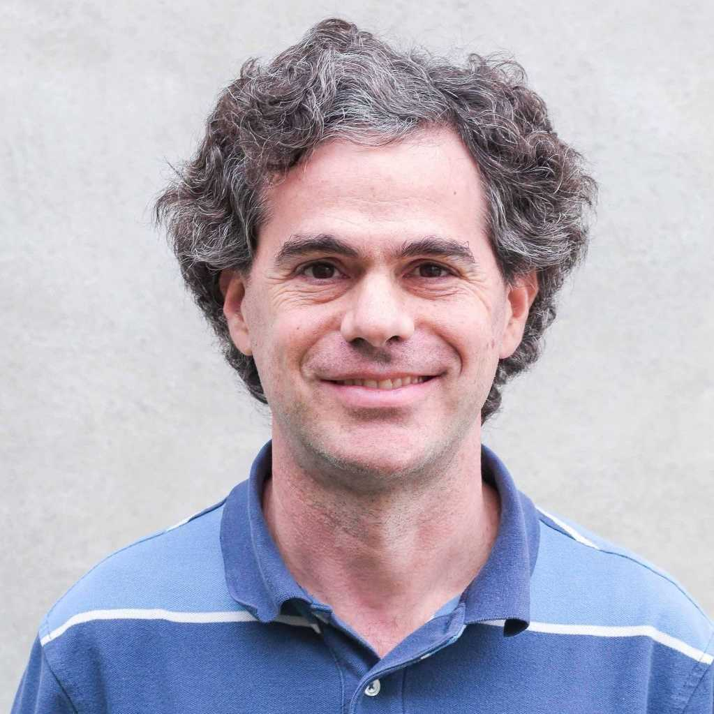

# LM_QEC

量子计算与量子纠错学习资料归档。

- [`reading/`](./reading/) — 论文、教材等阅读资料
- [`what_i_learn/`](./what_i_learn/) — 学习笔记
- [`CHANGELOG.md`](./CHANGELOG.md) — 更新日志

---

**Quantum Error Correction Sonnet** — *Daniel Gottesman*

We cannot clone, perforce; instead, we split 
Coherence to protect it from that wrong 
That would destroy our valued quantum bit 
And make our computation take too long.

Correct a flip and phase — that will suffice. 
If in our code another error's bred, 
We simply measure it, then God plays dice, 
Collapsing it to X or Y or Zed.

We start with noisy seven, nine, or five 
And end with perfect one. To better spot 
Those flaws we must avoid, we first must strive 
To find which ones commute and which do not.

With group and eigenstate, we've learned to fix 
Your quantum errors with our quantum tricks.

